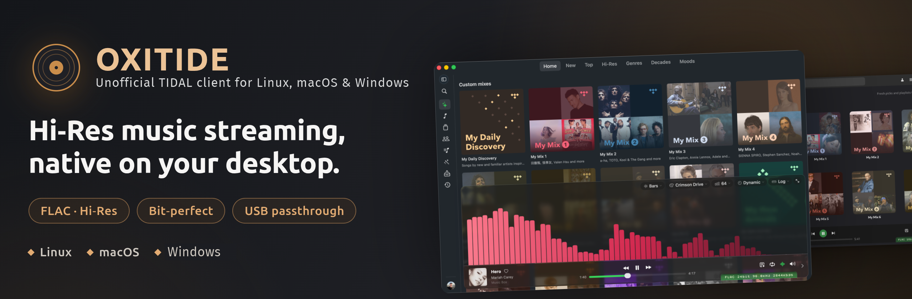
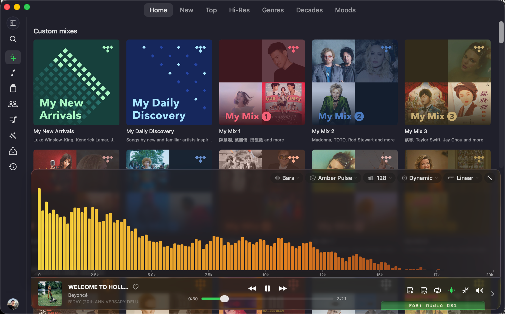

[](https://github.com/yelanxin/OxiTide/releases)

<p align="center">
  
</p>

<h1 align="center">OxiTide</h1>

**OxiTide** is a high-resolution TIDAL player for Linux and macOS, written in Rust — a GTK4 front-end on Linux, a native SwiftUI front-end on macOS, one shared playback engine.

It is the native successor to [hiresTI](https://github.com/yelanxin/hiresTI) — same bit-perfect playback engine, same USB Rawlink direct-to-DAC output, rebuilt from the ground up with a native Rust UI: faster startup, lower memory, no Python runtime.

## Highlights

- **Bit-perfect playback** — untouched PCM straight to your DAC
- **USB Rawlink** (Linux) — direct USB audio transport, bypassing the OS mixer entirely
- **CoreAudio Exclusive mode** (macOS) — hog mode plus integer mode, the DAC's native rate and format
- **Hi-Res / FLAC streaming** with gapless playback
- **Native performance** — a single self-contained binary, instant startup
- Spectrum visualizer, level meter, synced lyrics, MPRIS integration



## Install

OxiTide is **free to use**. Packages for every supported distribution and the
macOS app are on the [**Releases**](https://github.com/yelanxin/OxiTide/releases) page.

### macOS

Quick install:

```bash
curl -fsSL https://raw.githubusercontent.com/yelanxin/OxiTide/main/install.sh | bash
```

Downloads the newest macOS build, verifies its checksum and puts
`OxiTide.app` in Applications, cleared to open on first launch. Re-run it to
update.

Or by hand: download the newest `OxiTide-<ver>-macos-universal.zip` from the
[Releases](https://github.com/yelanxin/OxiTide/releases) page (Apple silicon
and Intel in one bundle, macOS 14 or later), unzip it, and move `OxiTide.app`
to Applications. macOS builds ship on their own schedule, so the newest macOS
zip may sit on a different release than the newest Linux packages. The build is not notarized yet: on first launch
macOS will refuse to open it — go to **System Settings → Privacy & Security**
and choose **Open Anyway**, or right-click the app and choose Open.

Sign in with the **Login to TIDAL** button (browser sign-in; a device code is
offered as a fallback). For bit-perfect playback turn on **Exclusive access**
in Settings → Audio: OxiTide takes the device in CoreAudio hog mode and runs it
at the track's own rate and bit depth. Shared mode plays through the system
mixer at whatever rate the device is set to.

Settings and login live in `~/Library/Application Support/OxiTide`; logs are
written to `~/Library/Logs/OxiTide/oxitide.log`.

#### What the macOS build has, and what is still to come

The macOS build covers browsing and playback end to end; a few of the Linux
build's extras have not been ported yet.

| Feature | Linux | macOS |
|---|---|---|
| Discover (Home / New / Top / Hi-Res / Genres / Decades / Moods), search | ✓ | ✓ |
| Library: tracks, albums, artists, playlists, mixes, uploads, history | ✓ | ✓ |
| Favourites, add to playlist, Play Next / Add to Queue, queue drawer | ✓ | ✓ |
| Now Playing page with Queue / Album / Suggested (track radio) / Lyrics tabs, spectrum visualizer, play modes | ✓ | ✓ |
| Lyrics drawer with synced, click-to-seek lyrics | ✓ | ✓ |
| Mini player | ✓ | ✓ |
| Bit-perfect exclusive output, hardware volume (with a software-gain fallback), streaming quality | ✓ | ✓ |
| Last.fm / ListenBrainz scrobbling | ✓ | ✓ |
| Media keys, system Now Playing panel (Control Center, lock screen) | ✓ (MPRIS) | ✓ |
| Menu bar / tray icon with playback controls; close hides the window | ✓ | ✓ |
| Keyboard shortcuts (Space, ← / →, S, W, Q, L, Esc) | ✓ | ✓ |
| Accent colour, compact sidebar, grid / list layouts | – | ✓ |
| DSP chain (PEQ, convolution, tube / tape, widener, limiter, resampler) and presets | ✓ | planned |
| LUFS / DR meter | ✓ | planned |
| Queue reordering / removal, search history | ✓ | planned |
| Remote control HTTP API, update check | ✓ | later |
| USB Rawlink direct-to-DAC transport | ✓ | not applicable (CoreAudio hog mode instead) |

### Linux

#### Quick install

```bash
curl -fsSL https://raw.githubusercontent.com/yelanxin/OxiTide/main/install.sh | bash
```

Detects your distribution, downloads the matching package from the newest
release that has one, and installs it with your native package manager
(x86_64: Arch, Debian 13+, Ubuntu 24.04+, Fedora 43+, openSUSE Tumbleweed
— and their derivatives). The same script installs the macOS build on a Mac.

#### Snap

[](https://snapcraft.io/oxitide)

Available on any distribution with snapd:

```bash
sudo snap install oxitide
```

If audio output or your USB DAC is not detected, connect the audio interfaces
once (not needed after the store enables auto-connection):

```bash
sudo snap connect oxitide:alsa
sudo snap connect oxitide:raw-usb
```

#### Flatpak

Available on any distribution from the official OxiTide Flatpak repository
([flatpak.oxitide.com](https://flatpak.oxitide.com)):

```bash
flatpak install --user https://flatpak.oxitide.com/oxitide.flatpakref
```

Launch it from the app menu, or with
`flatpak run io.github.yelanxin.OxiTide`. The GNOME runtime is fetched from
Flathub automatically. For bit-perfect USB Rawlink output the app asks you to
install a one-line udev rule on first use (the Flatpak sandbox cannot install
it itself).

#### Manual install

| Distribution | Install |
|---|---|
|  Arch Linux / Manjaro / CachyOS | `yay -S oxitide-bin` (AUR: [oxitide-bin](https://aur.archlinux.org/packages/oxitide-bin)) — or `sudo pacman -U oxitide-<ver>-1-x86_64_archlinux.pkg.tar.zst` |
|  Debian 13+ | `sudo apt install ./oxitide_<ver>_amd64_debian13.deb` |
|  Ubuntu 24.04 / 26.04 | `sudo apt install ./oxitide_<ver>_amd64_ubuntu2404.deb` (or `_ubuntu2604.deb`) |
|  Fedora 43 / 44 | `sudo dnf install ./oxitide-<ver>-1.fedora.x86_64_fedora44.rpm` (or `_fedora43.rpm`) |
|  openSUSE Tumbleweed | `sudo zypper install ./oxitide-<ver>-1.opensuse.x86_64_opensuse_tumbleweed.rpm` |

Requirements: a TIDAL subscription and GTK 4.14+ (Debian 12 is not supported).
For bit-perfect USB Rawlink output the package installs a udev rule and a polkit
action so the app can claim your DAC — the first use asks for authorization.

Settings and login live in `~/.config/oxitide`, so OxiTide installs cleanly
alongside hiresTI.

#### Updating

Re-run the quick-install command above (it always picks the latest release and
upgrades in place), or download the new package and install it the same way.
AUR: `yay -Syu`. Flatpak: `flatpak update`. Snap updates automatically. The app also checks for new
releases itself (**Check for Updates** in the menu).

## License

OxiTide is proprietary freeware — free to download and use, not open source.
Redistribution of modified binaries is not permitted. Third-party open-source
components are acknowledged in the `THIRD-PARTY-NOTICES` file shipped with each release.

Looking for the open-source edition? The Python/GTK version lives on at
[hiresTI](https://github.com/yelanxin/hiresTI) (GPL-3.0).

## Feedback

Bug reports and feature requests are welcome in the
[Issues](https://github.com/yelanxin/OxiTide/issues) of this repository.

---

*OxiTide is an independent project and is not affiliated with or endorsed by TIDAL.*

