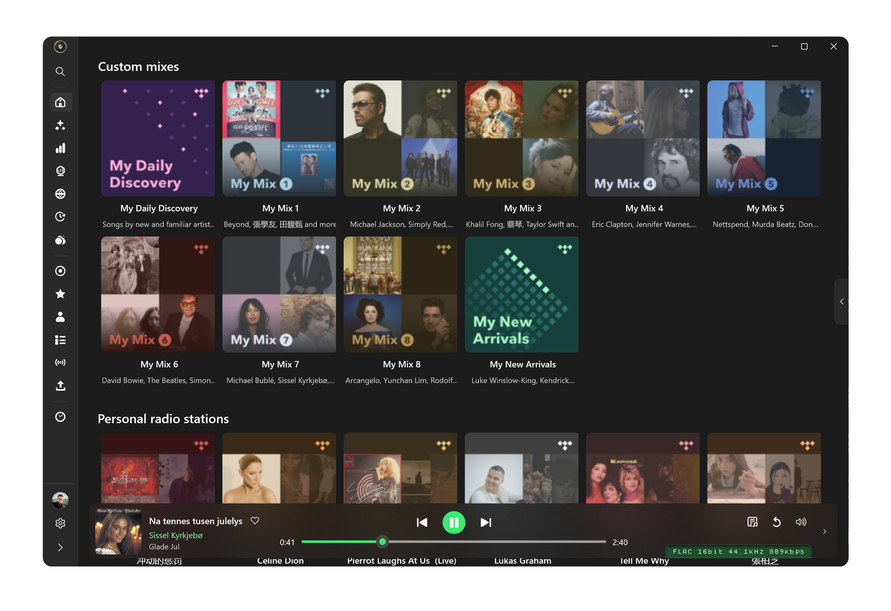

[](https://github.com/yelanxin/OxiTide/releases)

<p align="center">
  
</p>

<h1 align="center">OxiTide</h1>

**OxiTide** is a high-resolution TIDAL player for Linux, macOS and Windows, written in Rust — a GTK4 front-end on Linux, a native SwiftUI front-end on macOS, a native WinUI 3 one on Windows, all on the same playback engine.

It is the native successor to [hiresTI](https://github.com/yelanxin/hiresTI) — same bit-perfect playback engine, same USB Rawlink direct-to-DAC output, rebuilt from the ground up with a native Rust UI: faster startup, lower memory, no Python runtime.

## Highlights

- **Bit-perfect playback** — untouched PCM straight to your DAC
- **USB Rawlink** (Linux) — direct USB audio transport, bypassing the OS mixer entirely
- **CoreAudio Exclusive mode** (macOS) — hog mode plus integer mode, the DAC's native rate and format
- **WASAPI Exclusive mode** (Windows) — the system mixer out of the path, the device at the track's own rate and bit depth
- **Hi-Res / FLAC streaming** with gapless playback
- **Native performance** — a single self-contained binary, instant startup
- Spectrum visualizer, level meter, synced lyrics, MPRIS integration

Browsing and playback are the same on all three platforms; a few extras are
still Linux-only. The [feature matrix and roadmap](ROADMAP.md) tracks what
each build has today and what is coming next.

**Linux** — GTK4 / libadwaita


**macOS** — SwiftUI


**Windows** — WinUI 3



## Install

OxiTide is **free to use**. Packages for every supported distribution, the
macOS app and the Windows build are on the
[**Releases**](https://github.com/yelanxin/OxiTide/releases) page.

### macOS

macOS 14 or later; Apple silicon and Intel in one bundle.

```bash
curl -fsSL https://raw.githubusercontent.com/yelanxin/OxiTide/main/install.sh | bash
```

Downloads the newest build, verifies its checksum, puts `OxiTide.app` in
Applications and clears it to open. Re-run it to update.

By hand instead: unzip `OxiTide-<ver>-macos-universal.zip` from
[Releases](https://github.com/yelanxin/OxiTide/releases) into Applications.
The build is not notarized yet, so the first launch needs **System Settings
→ Privacy & Security → Open Anyway**.

The project does not have an Apple Developer membership yet, which is what
signing and notarizing require. [Sponsorship](https://github.com/sponsors/yelanxin)
is very welcome and goes towards it: with the membership in place the macOS
build will be signed, and it will open without any warning.

For bit-perfect playback turn on **Exclusive access** in Settings → Audio:
OxiTide takes the device in CoreAudio hog mode and runs it at the track's own
rate and bit depth. Settings and login live in
`~/Library/Application Support/OxiTide`, logs in
`~/Library/Logs/OxiTide/oxitide.log`.

A few of the Linux build's extras are not ported yet — the
[feature matrix](ROADMAP.md) tracks what each build has.

### Windows

Windows 10 (1809 or later) or Windows 11, 64-bit. Two downloads on the
[Releases](https://github.com/yelanxin/OxiTide/releases) page, neither
needing a runtime installed first:

| Download | What it does |
|---|---|
| `OxiTide-<ver>-windows-x64.exe` | Installs into Program Files, with a Start menu entry and an uninstall entry |
| `OxiTide-<ver>-windows-x64-portable.zip` | Unzip and run `OxiTide.exe` from anywhere — nothing is installed |

The builds are not code-signed yet, so the first launch shows **"Windows
protected your PC"**: choose **More info → Run anyway**.

The project does not have a code-signing certificate yet.
[Sponsorship](https://github.com/sponsors/yelanxin) is very welcome and goes
towards one: a signed build no longer trips SmartScreen.

Output goes through **WASAPI in exclusive mode**, on by default: the system
mixer is out of the path and the device runs at the track's own rate and bit
depth. Pick the endpoint, or turn exclusive off, in **Settings → Output**.
Settings and the session token live in `%APPDATA%\OxiTide`, the engine's
`engine.log` beside the executable.

The Now Playing page, the visualizer, the DSP chain, scrobbling, media keys
and the tray icon are not ported yet — the [feature matrix](ROADMAP.md)
tracks what each build has.

### Linux

#### Quick install

```bash
curl -fsSL https://raw.githubusercontent.com/yelanxin/OxiTide/main/install.sh | bash
```

Detects your distribution, downloads the matching package from the newest
release that has one, and installs it with your native package manager
(x86_64: Arch, Debian 13+, Ubuntu 24.04+, Fedora 43+, openSUSE Tumbleweed
— and their derivatives). The same script installs the macOS build on a Mac.

#### Snap

[](https://snapcraft.io/oxitide)

Available on any distribution with snapd:

```bash
sudo snap install oxitide
```

If audio output or your USB DAC is not detected, connect the audio interfaces
once (not needed after the store enables auto-connection):

```bash
sudo snap connect oxitide:alsa
sudo snap connect oxitide:raw-usb
```

#### Flatpak

Available on any distribution from the official OxiTide Flatpak repository
([flatpak.oxitide.com](https://flatpak.oxitide.com)):

```bash
flatpak install --user https://flatpak.oxitide.com/oxitide.flatpakref
```

Launch it from the app menu, or with
`flatpak run io.github.yelanxin.OxiTide`. The GNOME runtime is fetched from
Flathub automatically. For bit-perfect USB Rawlink output the app asks you to
install a one-line udev rule on first use (the Flatpak sandbox cannot install
it itself).

#### Manual install

| Distribution | Install |
|---|---|
|  Arch Linux / Manjaro / CachyOS | `yay -S oxitide-bin` (AUR: [oxitide-bin](https://aur.archlinux.org/packages/oxitide-bin)) — or `sudo pacman -U oxitide-<ver>-1-x86_64_archlinux.pkg.tar.zst` |
|  Debian 13+ | `sudo apt install ./oxitide_<ver>_amd64_debian13.deb` |
|  Ubuntu 24.04 / 26.04 | `sudo apt install ./oxitide_<ver>_amd64_ubuntu2404.deb` (or `_ubuntu2604.deb`) |
|  Fedora 43 / 44 | `sudo dnf install ./oxitide-<ver>-1.fedora.x86_64_fedora44.rpm` (or `_fedora43.rpm`) |
|  openSUSE Tumbleweed | `sudo zypper install ./oxitide-<ver>-1.opensuse.x86_64_opensuse_tumbleweed.rpm` |

Requirements: a TIDAL subscription and GTK 4.14+ (Debian 12 is not supported).
For bit-perfect USB Rawlink output the package installs a udev rule and a polkit
action so the app can claim your DAC — the first use asks for authorization.

Settings and login live in `~/.config/oxitide`, so OxiTide installs cleanly
alongside hiresTI.

#### Updating

Re-run the quick-install command above (it always picks the latest release and
upgrades in place), or download the new package and install it the same way.
AUR: `yay -Syu`. Flatpak: `flatpak update`. Snap updates automatically. The app also checks for new
releases itself (**Check for Updates** in the menu).

## License

OxiTide is proprietary freeware — free to download and use, not open source.
Redistribution of modified binaries is not permitted. Third-party open-source
components are acknowledged in the `THIRD-PARTY-NOTICES` file shipped with each release.

Looking for the open-source edition? The Python/GTK version lives on at
[hiresTI](https://github.com/yelanxin/hiresTI) (GPL-3.0).

## Feedback

Bug reports and feature requests are welcome in the
[Issues](https://github.com/yelanxin/OxiTide/issues) of this repository.


---

*OxiTide is an independent project and is not affiliated with or endorsed by TIDAL.*

